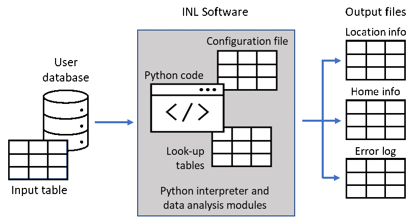

## Location Generalizer

### **Revision Log**

Release 1.2 included the following changes:
* 	Added Python library dataclasses
* 	Added new field 'num_cores' to .yml file to determine how many cores to use during parallel computation
* 	Added location_generalizer/utils.py and location_generalizer/dataclasses.py
* 	Modified processHome by adding new parallel/vectorized functionality when updating vLocationInfo
* 	Fixed a bug in processHome (now vectorizedUpdateVehicleLocationInfo) where off-by-1 index lookups were causing incorrect comparisons

Release 1.1 included the following changes:
*	Cluster ID for start and end of trip was added to LocationInfo output file

Release 1.0 included the following changes:
*	Added Python library sqldf
*	Updated algorithm for classifying vehicle home location and handling multiple home locations for the same vehicle
*	Added new fields (TripStartHomeID, TripEndHomeID) to Location Info output file for clarity when there are multiple home locations for the same vehicle 
*	Added new field (HomeID) to Home Info output file for clarity when there are multiple home locations for the same vehicle
*	Changed precision of PublicChargingDensityL2 to be rounded to the nearest 100 charging sites
	Changed precision of PublicChargingDensityDCFC to be rounded to the nearest 10 charging sites
*	Updated error handling to write new error cases to error log
*	Keyboard interaction removed for performance gains

### **Overview**

This software was developed by Idaho National Laboratory (INL) to produce general location descriptions from time-series location data collected from mobile devices that record global positioning system (GPS) coordinates over time. The purpose of this software is to convert detailed location history data, which is considered personally identifiable information (PII), into non-traceable, anonymized, generic information that is useful to researchers but does not contain PII. The software is specifically designed to process data that describe the parked locations and dwell times of automobiles, where data is logged at the beginning and end of each trip. The software infers where vehicles' homes are and produces metrics generally describing vehicle location relative to home.

### **Software Architecture**

Location Generalizer, hereafter referred to as "the software," consist of Python scripts, a library of look-up tables containing open-source information, and a configuration file. Figure 1 depicts the basic software architecture, including inputs and outputs. The software will require connection to the user's database, from which it will query data from a table that meets specific requirements. This table is referred to in this document as the "input table," because it is the source of input data for the software. The software will output three files. The input table and output files are explained in detail in the next section of this document.

### **Installation**

To run the software, the user will need to install an open-source Python interpreter, downloadable from python.org. The software was developed using Python 3.7.8 from python.org. Running the software in an earlier version of Python may produce errors.

The user also needs to install the following Python libraries in the order listed. This is done from the Command Prompt (CMD). It is recommended that CMD be run as administrator:

`python -m pip install pyodbc`

`python -m pip install numpy=1.19.3`

`python -m pip install pandas`

`python -m pip install pyyaml`

`python -m pip install sklearn`

`python -m pip install shapely`

`python -m pip install haversine`

`python -m pip install pynput`

`python -m pip install sqlalchemy`

`python -m pip install pandasql`

`python -m pip install dataclasses`

***To install GDAL***

>Go to https://www.lfd.uci.edu/~gohlke/pythonlibs/#gdal and download the GDAL wheel.
>Find GDAL-3.1.4-cp*XX*-cp*XX*m-win_amd64.whl and download,
>where *XX* matches your Python version.
>For example: GDAL-3.1.4-cp*37*-cp*37*m-win_amd64.whl
>
>Note: 
>Find your Python version by typing `python` in your command prompt.
>The first line displayed shows the python version.
>You might find something like:
>Python 3.7.8 (tags/v3.7.8:4b47a5b6ba, Jun 28 2020, 08:53:46) …
>Notice the 3.7 in the version number. This means you will want to download:
>GDAL-3.1.4-cp37-cp37m-win_amd64.whl
>
>`python -m pip install GDAL-3.1.4-cp37-cp37m-win_amd64.whl` *(replace filename with appropriate version for your python)*

***To install Fiona***

> Go to https://www.lfd.uci.edu/~gohlke/pythonlibs/#fiona and download the Fiona wheel.
> Find Fiona-1.8.18-cp*XX*-cp*XX*m-win_amd64.whl and download,
> where *XX* matches your Python version.
> For example: Fiona-1.8.18-cp*37*-cp*37*m-win_amd64.whl
>
> `python -m pip install Fiona-1.8.18-cp37-c37m-win_amd64.whl` *(replace filename with appropriate version for your python)*

 

`python -m pip install geopandas`

 

### **GitHub Downloads**

The program files needed can be downloaded from https://github.com/idaholab/Location-Generalizer. Click on the **`Code`** button, then click **`Download ZIP`** from the menu. This will download a file Location-Generalizer-main.zip. Extract this file into a directory of your choosing. After extraction, there should be several files in the directory chosen, and a sub-directory called `data` containing two files:

`<your_directory>`

> LICENSE
>
> NOTICE.txt
>
> README.md
>
> locationGeneralizer.py
>
> locationGeneralizer.yml
>
> Figure1.png
>
> `data`

> > AFDC_stations.csv
> >
> > divisions.pkl

### System Requirements

The software was be designed to run on a desktop computer with 16 GB of RAM or more, running a Microsoft Windows operating system. Windows 10 (64-bit) is recommended.

### Input Requirements

The software is self-contained, meaning that it does *not* require connecting to external data sources via the use of an application programming interface (API). As indicated in Figure 1, the only necessary input is data from the user's database. To be database-agnostic, the software connects to the user's database using an Open Database Connectivity (ODBC) driver.

***Creating the Input Table***

The user shall create the input table in their database that contains the fields shown in Table 1:

Table 1. Required fields in input table

| Field Name              | Description                                                  | Units           |           Precision |
| ----------------------- | ------------------------------------------------------------ | --------------- | ------------------: |
| VehicleID               | Unchanging, unique, arbitrary ID that  distinguishes each vehicle; the ID shall be unique across all vehicle models  from same manufacturer | n/a             |             Integer |
| TripStartLocalTime      | Local date and time at the beginning of each  trip (i.e., time at key-on) | Date/time       | yyyy/mm/dd HH:mm:ss |
| TripEndLocalTime        | Local date and time at the end of each trip  (i.e., time at key-off) | Date/time       | yyyy/mm/dd HH:mm:ss |
| TripStartLatitude       | Vehicle GPS latitude at start of trip                        | Decimal degrees |           XXX.XXXXX |
| TripStartLongitude      | Vehicle GPS longitude at start of trip                       | Decimal degrees |           XXX.XXXXX |
| TripEndLatitude         | Vehicle GPS latitude at end of trip                          | Decimal degrees |           XXX.XXXXX |
| TripEndLongitude        | Vehicle GPS longitude at end of trip                         | Decimal degrees |           XXX.XXXXX |
| TripStartOdometer_Miles | Cumulative odometer reading at start of trip                 | Miles           |             XXX,XXX |
| TripEndOdometer_Miles   | Cumulative odometer reading at end of trip                   | Miles           |             XXX,XXX |

The input table shall be created to meet the following additional
requirements:

1.  The field names shall match the field names in Table 1.

2.  The input table shall contain data representing all trips logged during the time period of interest (e.g., calendar year 2019) by all vehicles to be analyzed.

To improve performance, a non-clustered index should be added to the table. The following example code can be used to add a non-clustered index to a table in Microsoft SQL Server:

> create nonclustered index idx_2 on [input table name] (VehicleID, TripStartLocalTime, TripStartLatitude, TripStartLongitude, TripEndLatitude, TripEndLongitude, TripStartOdometer_Miles, TripEndOdometer_Miles) include (TripEndLocalTime)

***Connecting the Software to the Database***

To connect the software to the database, the user should edit the ODBC connection string in the software's configuration file. The ODBC connection string contains the driver, server, database, and authentication method. The following are examples of ODBC connection strings with two different authentication methods:

> odbcConnectionString: Driver={SQL Server}; Server=\[server name\], [port number\]; Database=\[database name\]; Trusted_Connection=Yes;
>
> odbcConnectionString: Driver={SQL Server}; Server=\[server name\], [port number\]; Database=\[database name\]; ;UID=\[user ID\]; PWD=\[password\];

The configuration file also defines values for various parameters used throughout code. It also provides a documentation section to describe the parameters and data structures in the code.

Note that the software can be modified to import data from a flat file (e.g. comma-separated values \[.csv\] file) but performance will be dramatically slower. If this functionality is required, please contact INL.

### **Description of Data Processing Steps**

The software performs the following steps:

1.  Queries data from user database

2.  Performs data validity checks

3.  Clusters vehicle parked locations

4.  Determines each vehicle's home location(s)

5.  Calculates output metrics and writes them to output files

***Querying Data***

The software queries the input table and returns all distinct VehicleIDs. Then it iteratively queries all records with non-NULL fields in the input table for groups of 200 VehicleIDs, completing steps 2 through 5 for each group before querying data for the next group. The number of VehicleIDs for which data is returned per iteration can be changed in the configuration file. VehicleIDs with less than 30 trips in the input table are skipped (i.e., steps 2 through 5 are not performed for these vehicles due to insufficient data).

***Validity Checks***

The following validity checks are made for each vehicle:

1.  Check that timestamps are in date/time format. If not, convert to date/time format. If conversion fails, exclude record.

2.  Check that timestamps are not before Jan 1, 2010 or after the current date/time. If check fails, exclude record.

3.  Check that vehicle latitude/longitude is within the continental US, Alaska, or Hawaii. If check fails, exclude record.

4.  Check that the difference between the trip distance and the straight-line distance between the trip's origin and destination is greater than or equal to -0.5 miles. If check fails, exclude record.

The number of records failing each check and excluded from further processing for each VehicleID is written to the error log.

***Clustering***

For one vehicle at a time, the software clusters historical parked locations using DBSCAN from the sklearn clustering module (see <https://scikit-learn.org/stable/modules/generated/sklearn.cluster.DBSCAN.html>). Epsilon, which is the maximum distance between two samples for one to be
considered as in the neighborhood of the other, is set to 0.0305 km (100 ft). The minimum number of samples per cluster is set to one.

***Determining Vehicle Home Location***

The software uses a simple but effective classification decision tree model to predict the home location(s) for each vehicle. The software classifies parking location clusters as ‘home’ or ‘away’ (i.e., not home) for all vehicles for which sufficient data is available. The software is tuned to avoid falsely classifying a home location as ‘away’ (false negative). The following criteria must be met in order for the software to classify a vehicle’s home location:

1.	The last trip of the day can be positively identified for the vehicle on at least 30 days
2.	For at least one parking location cluster, there were more than 21 days between the first and last parking event in the cluster (i.e., at that location)
3.	For at least one parking location cluster, there are 15 or more parking events in the cluster

For vehicles meeting the above criteria, clusters are classified as ‘home’ if either of the following two conditions are met:

1.	The last trip of the day ends in the cluster (i.e., at that location) on over 65% of the days on which the last trip can be positively identified  
&lt;or&gt;
2.	The last trip of the day ends in the cluster on 65% or fewer of the days with known last trips, and the total time spent parked in the cluster per complete driving day is greater than 9 hours. 
A complete day is defined as a day with no missing miles (i.e., no increments in the odometer) between logged trips.

If neither of these conditions are met, the cluster is classified as ‘away.’

Because vehicles may have multiple home locations and/or the home location(s) may change over time, each distinct home location (i.e., cluster classified as ‘home’) for each vehicle is assigned a unique ID. For periods of time when there are multiple home locations for a vehicle, the primary home location is determined. The primary home is defined as the home location where the vehicle is most often parked after the last trip of the day during the period with multiple homes. Note that there also may be periods of time when there is no home location identified for a vehicle. 

***Calculating and writing output metrics***

After home locations are determined, the software calculates metrics that generally describe the home location and the vehicle location relative to the home location at the start and end of every trip. The software writes these metrics to two output files, called Location Info and Home Info. The software also outputs a third file -- the error log.

### **Description of Outputs**

***Location Info***

Location Info contains records that correspond with every trip logged by every vehicle. The fields in Location Info are listed in Table 2.
Records in Location Info can be joined with trip data in the user's database on the fields VehicleID and TripStartLocalTime.

Table 2. Contents of Location Info output file

| Field Name                      | Description                                                  | Units                                                    |           Precision |
| ------------------------------- | ------------------------------------------------------------ | -------------------------------------------------------- | ------------------: |
| VehicleID                       | Unchanging, unique, arbitrary ID that  distinguishes each vehicle; the ID shall be unique across all vehicle models  from same manufacturer | n/a                                                      |             Integer |
| TripStartHomeID                 | HomeID of the home location where the vehicle is parked at the beginning of the trip. If the vehicle is not parked at a home location or if there is no home location identified at this time, then this field is NULL | n/a                                                      |             Integer |
| TripEndHomeID                   | HomeID of the home location where the vehicle is parked at the end of the trip. If the vehicle is not parked at a home location or if there is no home location identified at this time, then this field is NULL | n/a                                                      |             Integer |
| TripStartLocalTime              | Local date and time at the beginning of each  trip (i.e., time at key-on) | Date/time                                                | yyyy/mm/dd HH:mm:ss |
| TripEndLocalTime                | Local date and time at the end of each trip  (i.e., time at key-off) | Date/time                                                | yyyy/mm/dd HH:mm:ss |
| TripStartDistanceFromHome_Miles | Straight-line distance between the vehicle’s parked location at the start of trip and its primary home location at this time. If there is no primary home location identified at this time, this field is NULL. | Miles                                                    |                 XXX (i.e., integer) |
| TripEndDistanceFromHome_Miles   | Straight-line distance between the vehicle’s parked location at the end of trip and its primary home location at this time. If there is no primary home location identified at this time, this field is NULL. | Miles                                                    |                 XXX (i.e., integer) |
| TripStartLocationCategory       | Description of vehicle parked location at start of trip. If there is no home location identified at this time, this field is ‘unknown.’ | Possible values: ‘home,’ ‘away,’ or ‘unknown’ |                 n/a |
| TripEndLocationCategory         | Description of vehicle parked location at end of trip. If there is no home location identified at this time, this field is ‘unknown.’ | Possible values: ‘home,’ ‘away,’ or ‘unknown’ |                 n/a |
| TripStartClusterID      | For each VehicleID, a unique serial number identifying each distinct location (i.e., centroid of clustered GPS coordinates) where the vehicle was parked prior to the start of the trip. | n/a           |             Integer |
| TripEndClusterID        | For each VehicleID, a unique serial number identifying each distinct location (i.e., centroid of clustered GPS coordinates) where the vehicle was parked after the end of the trip. | n/a           |             Integer |

***Home Info***

Home Info contains records that correspond with the number of distinct home locations determined by the software for every vehicle. The fields in Home Info are listed in Table 3. Because some vehicle home locations may change over time, this file may contain multiple records per vehicle. The records in this file can be joined with trip data in the user's database on the fields VehicleID and TripStartLocalTime.

Table 3. Contents of Home Info output file

| Field Name                | Description                                                  | Units                    |           Precision |
| ------------------------- | ------------------------------------------------------------ | ------------------------ | ------------------: |
| VehicleID                 | Unchanging, unique, arbitrary ID that   distinguishes each vehicle; the ID shall be unique across all vehicle models   from same manufacturer | n/a                      |             Integer |
| HomeID                    | Unchanging, unique, arbitrary ID that distinguishes each distinct home location for a single vehicle | n/a                      |             Integer |
| HomeStartLocalTime        | Local date and time that defines beginning   of the period when the location is known to be the vehicle’s home (based on   TripEndLocalTime) | Date/time                | yyyy/mm/dd HH:mm:ss |
| HomeEndLocalTime          | Local date and time that defines end of the   period when the location is known to be the vehicle’s home (based on   TripEndLocalTime) | Date/time                | yyyy/mm/dd HH:mm:ss |
| HomeRegion                | U.S. region in which   vehicle home location resides (see below for more information) | n/a                      |         Text string |
| PublicChargingDensityL2   | Number of public AC Level 2 charging sites   within 25 miles of home location* | Number of charging sites | Rounded to the nearest 100 charging sites** |
| PublicChargingDensityDCFC | Number of public DC fast charging sites   within 25 miles of home location* | Number of charging sites | Rounded to the nearest 10 charging sites** |

\* Public AC Level 2 and DC fast charging sites of any brand or connector type within 25 miles of home are counted, regardless of compatibility with the vehicle.

\** If there are no charging sites within 25 miles, this field will show -1

***Determination of HomeRegion***

The HomeRegion field provides the U.S. region in which each vehicle's home location resides. The software defines U.S. regions according to the "division" definition given in document "[2010 Census Regions and Divisions of the United States](https://www.census.gov/geographies/reference-maps/2010/geo/2010-census-regions-and-divisions-of-the-united-states.html)." The U.S. Census Bureau assigns each U.S. state to one of nine "divisions" of the nation. Table 4 lists the states included in each U.S. Census division.

Table 4. States in each U.S. Census Division

| U.S. Census Division Name | States in Division                                           |
| ------------------------- | ------------------------------------------------------------ |
| New England               | Connecticut, Massachusetts, Rhode Island, Maine, New Hampshire, Vermont |
| Mid Atlantic              | New Jersey, New York, Pennsylvania                           |
| East North Central        | Indiana, Illinois, Michigan, Ohio, Wisconsin                 |
| West North Central        | Iowa, Nebraska, Kansas, Minnesota, North Dakota, South Dakota, Missouri |
| South Atlantic            | Delaware, District of Columbia, Florida, Georgia, Maryland, North Carolina, South Carolina, Virginia, West Virginia |
| East South Central        | Alabama, Kentucky, Mississippi, Tennessee                    |
| West South Central        | Arkansas, Louisiana, Oklahoma, Texas                         |
| Mountain                  | Arizona, Colorado, Idaho, New Mexico, Montana, Nevada, Utah, Wyoming |
| Pacific                   | Alaska, California, Hawaii, Oregon, Washington               |

***Error Log***

The error log file provides the number of records for each vehicle that failed validity checks, and the VehicleIDs that were not processed because they had less than 30 trips. It also lists the VehicleIDs whose home location was not determined because the vehicle had less than 30 days with known last trips or because no clusters had sufficient data. VehicleIDs that had no home location identified are also written to the error log. Finally, if data processing is interrupted, the error log records the last VehicleID to finish processing. See below for more information on handling incomplete analysis software runs.

### Instructions for Running Software

***Compiling***

For fastest performance, it is recommended that the user compile the software before running. To compile the software, first install the nuitka library:

`python –m pip install nuitka`

Then, to compile, execute the following command from the directory where the GitHub files were installed:

`python -m nuitka --mingw64 locationGeneralizer.py`

> Note: 
> On first use it will prompt you to download MingGW64. 
> Type ***yes*** and press enter to answer the prompt:
>
> > Is it OK to download and put it in 
> > "<your-path>\Nuitka\Nuitka\gcc\x86_64\10.2.0-11.0.0-8.0.0-r5".
> > No installer needed, cached, one time question.
> > Proceed and download? [Yes]/No

***Running***

To run the software, start a Command Prompt or PowerShell window from the directory where the GitHub files were installed.

To run the uncompiled software, execute:

`python .\locationGeneralizer.py`

Or, if you have created the compiled version, execute:

`.\locationGeneralizer.exe`

***Monitoring Progress***

The software has a verbosity setting that allows the user to change how much information is written to the screen as the software runs. The verbosity setting defaults to 0. This setting can be changed in the locationGeneralizer.yml configuration file to 0, 1, or 2. 

When verbosity = 0, the software will display the group of VehicleIDs currently being processed (recall that the software processes batches of 200 vehicles). It will also display the VehicleID of the last vehicle to complete processing if the process stopped and is restarted.

When verbosity = 1, the software will also display the VehicleID currently being processed and it will notify the user when it is fetching data for a new batch of VehicleIDs. It will also periodically display the cumulative average processing rate, in terms of vehicles per hour.

When verbosity = 2, the software will also notify the user when each processing step for each vehicle has begun.

***Stopping Processing and Managing Unintentional Interruptions***

To purposefully stop a software run (i.e., stop processing data), the user can hit the Ctrl-C key at any time. Processing on the current vehicle will stop immediately.

Interruption can also occur unintentionally due to a lost database server connection or other reasons. However, whether the interruption was intentional or not, the software must be manually restarted. It will recognize the VehicleID of the last vehicle that completed processing and begin processing the next vehicle to avoid duplication.

### Other Software

Idaho National Laboratory is a cutting edge research facility which is a constantly producing high quality research and software. Feel free to take a look at our other software and scientific offerings at:

[Primary Technology Offerings Page](https://www.inl.gov/inl-initiatives/technology-deployment)

[Supported Open Source Software](https://github.com/idaholab)

[Raw Experiment Open Source Software](https://github.com/IdahoLabResearch)

[Unsupported Open Source Software](https://github.com/IdahoLabCuttingBoard)

### License

Copyright 2020 Battelle Energy Alliance, LLC

Licensed under the 3-Part BSD (the "License");
you may not use this file except in compliance with the License.
You may obtain a copy of the License at

  https://opensource.org/licenses/BSD-3-Clause

Unless required by applicable law or agreed to in writing, software
distributed under the License is distributed on an "AS IS" BASIS,
WITHOUT WARRANTIES OR CONDITIONS OF ANY KIND, either express or implied.
See the License for the specific language governing permissions and
limitations under the License.

### Licensing

This software is licensed under the terms you may find in the file named "LICENSE" in this directory.

### Developers

By contributing to this software project, you are agreeing to the following terms and conditions for your contributions:

You agree your contributions are submitted under the BSD-3 Part license. You represent you are authorized to make the contributions and grant the license. If your employer has rights to intellectual property that includes your contributions, you represent that you have received permission to make contributions and grant the required license on behalf of that employer.
